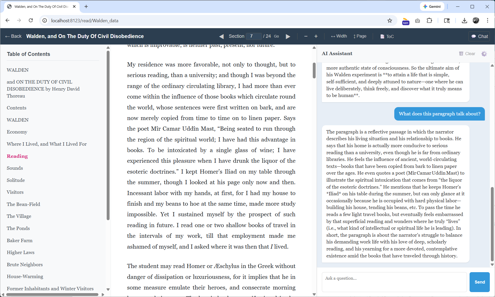

# reader 3



A lightweight, self-hosted EPUB reader that lets you read through EPUB books one chapter at a time. This makes it very easy to copy paste the contents of a chapter to an LLM, to read along. Basically - get epub books (e.g. [Project Gutenberg](https://www.gutenberg.org/) has many), open them up in this reader, copy paste text around to your favorite LLM, and read together and along.

This project was 90% vibe coded just to illustrate how one can very easily [read books together with LLMs](https://x.com/karpathy/status/1990577951671509438) by Mr. Karpathy. 

After branching off, I added pdf support, and a chat pane to allow the similar behavior like Gemini pane when you enable it inside Chrome browser. Currently, it only supports querying with selected text automatically to remote LLMs of your choice. Some interesting ideas could be starting from here, like how to do prompt and context management for the LLMs to make it more effective.

## Usage

The project uses [uv](https://docs.astral.sh/uv/). All books (source files and processed data) live in the `books/` subdirectory. For example, download [Dracula EPUB3](https://www.gutenberg.org/ebooks/345), then:

```bash
uv run reader3.py ~/Downloads/dracula.epub
```

This creates the directory `books/dracula_data`, which registers the book to your local library.

Similarly, you can also import PDF files. Just run the same command on a `.pdf` file:

```bash
uv run reader3.py ~/Downloads/mydocument.pdf
```

### Testing

Run the integration test suite to verify the application:

```bash
uv run pytest tests/test_server.py
```

### Running the Server

We can then run the server:

```bash
uv run server.py
```

And visit [localhost:8123](http://localhost:8123/) to see your current Library. You can easily add more books, or delete them from your library by deleting their folder under `books/`. It's not supposed to be complicated or complex.

## License

MIT